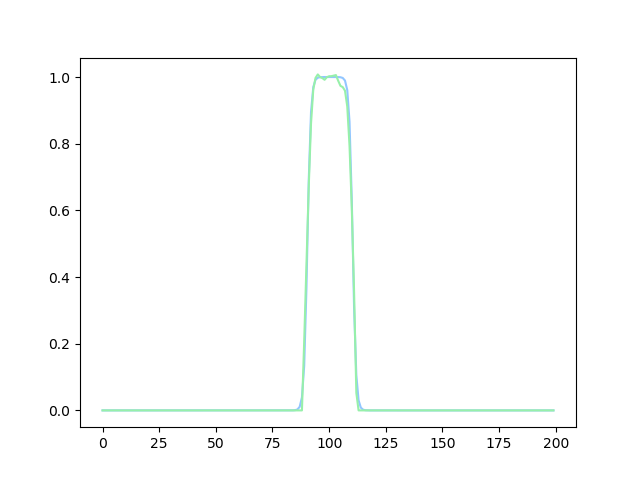
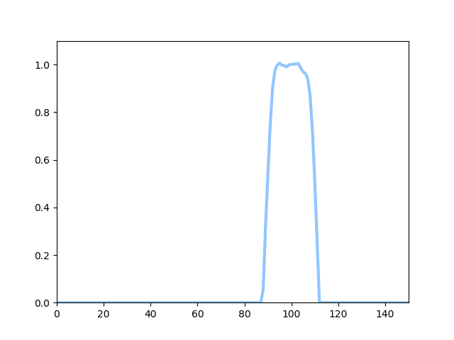

# LSTM :
LSTM stands for Long short-term memory. LSTM is a recurrent nueral network. Mostly network has feedforward model, where the information is flowing only in one direction. But LSTM has also connection for feedback, where information is flowing in both direction.
+ LSTM concises of mainly four gates.
1. Input gate
2. Output gate
3. Forget gate
4. Remember gate(Rarely)

+ More Info : https://arxiv.org/pdf/1808.03314.pdf

 

# Function:
Here, (in my_lstm.py) is a one-dimentional tangent hyperbolic-form profile (named phase field) converted with an oscillatory velocity field in discreted mesh. 
Althought the function file is very simple to iterate and compute desired data but for sake of simplicity we consider as a blackbox. Hence we imagine it as a highly computational expensive. In this blackbox supplying frequency and amplitude, we can get data of velocity and phase field.

# Model
we want our model to map from one time step to next time step. Intiuitavely when one time step is supplied to network, network can predict next time step.
&Phi;t &rarr; &Phi;t+1 

+ More Info about LSTM Model : Please refer documentaion of 

# Result
The result you can find below:
1. Result of specific snap of timestep

Blue - Ground truth, Green - Prediction

2. Result of all timesteps

+ Due to limited computed power, the code was run in accordance to lighter hyperparameter.

# Conclusion
The Blackbox is very useful to predict namely future, in case of highly computational demand network can efficienty predict next time step or at least error correction in very coarse grid by regression forrest.
